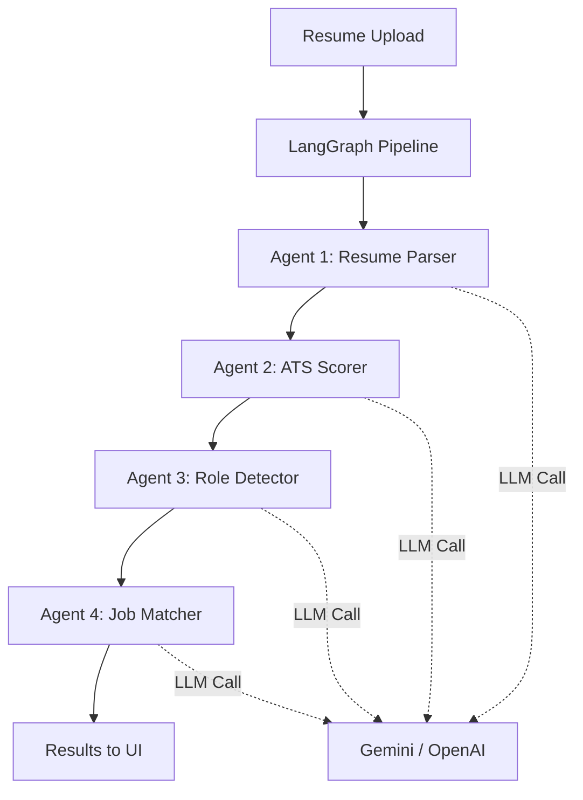

# 🚀 AI Career Copilot — Deployment Guide (v2 with LangGraph)

## Architecture



**Dual Mode:** If an API key is set → LangGraph agents with LLM. If not → rule-based fallback.

---

## 1. Get Your API Key

You need **one** of these (Gemini recommended — free tier):

| Provider | Free Tier | Get Key |
|----------|-----------|---------|
| **Google Gemini** ⭐ | 15 RPM, 1M tokens/day | [aistudio.google.com/apikey](https://aistudio.google.com/apikey) |
| **OpenAI** | Pay-per-use ($0.15/1M tokens) | [platform.openai.com/api-keys](https://platform.openai.com/api-keys) |

---

## 2. Local Setup

```bash
# Clone & enter project
git clone https://github.com/YOUR_USER/ai-career-copilot.git
cd ai-career-copilot
```

### Backend

```bash
cd backend
python -m venv venv
venv\Scripts\activate            # Windows
pip install -r requirements.txt
```

Create `backend/.env`:

```env
SECRET_KEY=your-random-64-char-string
DATABASE_URL=sqlite+aiosqlite:///./career_copilot.db
FRONTEND_URL=http://localhost:3000

# ← PASTE YOUR API KEY HERE ←
GEMINI_API_KEY=AIzaSy...your-gemini-key
AI_PROVIDER=gemini
AI_MODEL=gemini-2.0-flash

# OR for OpenAI:
# OPENAI_API_KEY=sk-...your-openai-key
# AI_PROVIDER=openai
# AI_MODEL=gpt-4o-mini
```

```bash
python -m uvicorn main:app --reload --port 8000
# ✅ http://localhost:8000/docs → Swagger UI
```

### Frontend

```bash
cd frontend
npm install
```

Create `frontend/.env.local`:

```env
NEXT_PUBLIC_API_URL=http://localhost:8000/api
NEXT_PUBLIC_APP_NAME=AI Career Copilot
```

```bash
npm run dev
# ✅ http://localhost:3000
```

---

## 3. Deploy Backend → Render (Free)

1. Push code to GitHub
2. Go to [render.com](https://render.com) → **New Web Service** → Connect repo

| Setting | Value |
|---------|-------|
| Root Directory | `backend` |
| Runtime | Python 3 |
| Build Command | `pip install -r requirements.txt` |
| Start Command | `uvicorn main:app --host 0.0.0.0 --port $PORT` |

3. **Environment tab** → Add:

```
SECRET_KEY       = <random string>
DATABASE_URL     = sqlite+aiosqlite:///./career_copilot.db
FRONTEND_URL     = https://your-app.vercel.app
GEMINI_API_KEY   = AIzaSy...your-key
AI_PROVIDER      = gemini
AI_MODEL         = gemini-2.0-flash
```

---

## 4. Deploy Frontend → Vercel (Free)

1. Go to [vercel.com](https://vercel.com) → **Add New Project** → Import repo
2. Set **Root Directory** = `frontend`
3. **Environment Variables**:

```
NEXT_PUBLIC_API_URL  = https://your-backend.onrender.com/api
NEXT_PUBLIC_APP_NAME = AI Career Copilot
```

4. Deploy!

---

## 5. Where Every API Key Goes

```
┌─────────────────────────┬────────────────────────────────┐
│ File / Dashboard        │ Keys to Paste                  │
├─────────────────────────┼────────────────────────────────┤
│ backend/.env            │ SECRET_KEY                     │
│                         │ GEMINI_API_KEY (or OPENAI_*)   │
│                         │ AI_PROVIDER + AI_MODEL         │
│                         │ FRONTEND_URL                   │
├─────────────────────────┼────────────────────────────────┤
│ frontend/.env.local     │ NEXT_PUBLIC_API_URL            │
│                         │ NEXT_PUBLIC_APP_NAME           │
├─────────────────────────┼────────────────────────────────┤
│ Render (Environment)    │ Same as backend/.env           │
├─────────────────────────┼────────────────────────────────┤
│ Vercel (Settings)       │ Same as frontend/.env.local    │
└─────────────────────────┴────────────────────────────────┘
```

> [!IMPORTANT]
> Never commit `.env` files to Git. They are excluded by `.gitignore`.
